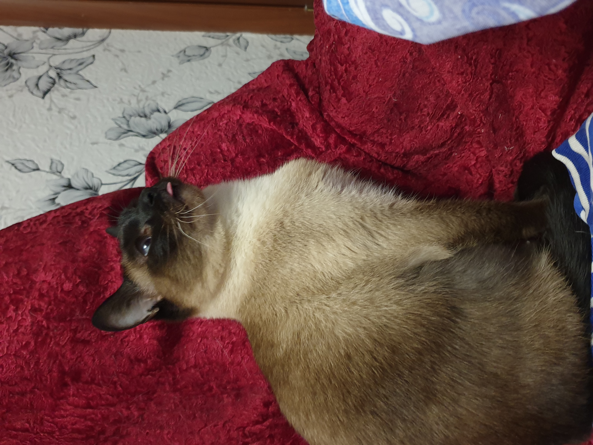

# Hello World
Чтобы проинициализировать (создать) репозиторий , мы используем: 
> git init -  создание репозитория

Чтобы создать репозиторий, мы используем команду:
>+ git add file-name - добавляется файл с именем file-name
>+ git add . - добавляются **все** файлы

Чтобы прокоментировать (сохранить изменения с комментарием), мы используем:
1. git commit -m "текст сообщения НА АНГЛИЙСКОМ" 

Чтобы увидеть журнал коммитов мы используем: 
>git log

Чтобы перемещаться по комитам, используем:
1. git checkout code_commit - переход с номером хэша коммина
2. git commit chekout master - переход к последнему коммиту

ЧТобы посмотреть изенения с закомиченной версией файла, используем:
> git diff

Чтобы посмотреть текущую ветку и какие ветки существуют, используем командку(звездочка указывает на какой ветке мы находимся):
> git branch
Для создания новой ветки:
> git branch (название новой ветки, англ., без ковычек)

Для слияния веток master и ветки "название" - необходимо из ветки мастер выполнить команду:
> git merge (название ветки, англ, без кавычек);
При наличии конфликтов слияния, программа предложит варианта - можно перенсти данные с присоединяемой ветки, можно оставить данные текущей, можно слить их и отредактировать, можэно их сравнить. 

Для визуального отображения ветвления проекта - нужно использовать команду:
> git log --graph 

Чтобы очистить терминал, используем команду 
> clear 

# Markdown инстуркция:

# Заголовки:
ЧТобы сделать заголовок, необходимо перед словом поставить знак (#), количество знаков = уровень подзаголовка, например:
# Заголовок 1
## Заголовок 2
### Заголовок 3

## Абзацы
Абзацы создаются при помощи пустой строки. Если вокруг текста сверху и снизу есть пустые строки, то текст превращается в абзац.

Чтобы сделать перенос строки вместо абзаца,
нужно поставить два пробела в конце предыдущей строки.  

## Выделение текста
> чтобы выделить текст курсивом надо обрамить текст звездочками (*) или знаком нижнего подчеркивания, например *вот* или _вот так вот_

> Чтобы выделить текст полужирным, надо обрамить его двойными звездочками (**) или знаком нижнего подчёркивания (__). Например **вот так** или  __вот так вот__

Альтернативные способы выделения теста жирным или курсивом, чтобы совмещать эти два способа, например: _текст может быть выделен курсисом и при этом быть **полужирным**_.

## Списки

Чтобы добавить ненумерованный список, необходимо выделить пункты звездочкой (*) или знаком (+), например:
* элемент 1
* элемент 2
* элемент 3
+ элемент 4

ЧТобы добавить нумерованные списки, необходимо пункты просто пронумеровать (с точкой), например:
1. Первый пункт
2. Второй пункт

## Работа с изображениями

ЧТобы вставить изображение в текст, достаточно написать следующее (квадратные скобки - сообщение которое говорит о том, что файл загружен, круглые - адрес файла изображения):

## Ссылки

## Работа с таблицами

## Цитаты

## Заключение